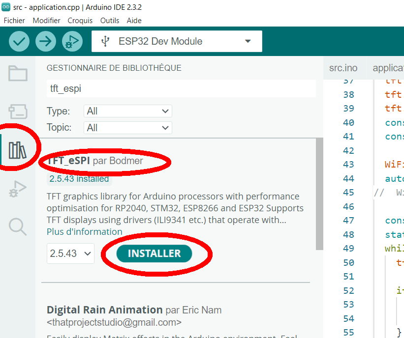

## Introduction to TFT_eSPI

*Mainy sourced from: [TFT_eSPI/README](https://github.com/Bodmer/TFT_eSPI/blob/master/README.md)*

The TFT_eSPI library is a feature-rich [Arduino IDE](https://www.arduino.cc/en/software) compatible graphics and fonts
library designed for 32-bit processors. It is targeted at processors such as RP2040, STM32, ESP8266, and ESP32, and has
been performance optimized for these platforms. Other 32-bits processors may be used but will use the slower generic 
Arduino interface calls. The library is known for its speed, with rendering performance typically 3 to 10 times faster
than other libraries.

The screen controller, interface pins and library configuration settings must be defined inside the library. They can 
**not** be defined in the Arduino sketch. See the
[`User_Setup_Select.h`](https://github.com/Bodmer/TFT_eSPI/blob/master/User_Setup_Select.h) file for details.
This approach has significant advantages, it keeps the examples clean from long configuration options and once the setup
is defined any example can be run without modification. PlatformIO users can define these settings on a per project
basis within a platformio.ini file, see [Docs folder](https://github.com/Bodmer/TFT_eSPI/tree/master/docs) in library.

Lots of example sketches are provided which demonstrate using the functions in the library. Due to the popularity of the
library there are lots of online tutorials for TFT_eSPI that have been created by enthusiastic users (*references will 
be provided later on*).

## Hardware and Software Requirements

To use the TFT_eSPI library, you will need a 32-bit processor such as an ESP32 or RP2040, and a TFT display that is 
compatible with the library. The library supports a wide range of display drivers, including ILI9341 and ST7796
SPI-based displays. You will also need to have the Arduino IDE or [PlatformIO](https://platformio.org/) installed on
your computer.

Optimised drivers have been tested with the following processors:

* RP2040, e.g. Raspberry Pi Pico
* ESP32 and ESP32-S2, ESP32-C3, ESP32-S3
* ESP8266
* STM32F1xx, STM32F2xx, STM32F4xx, STM32F767 (higher RAM processors recommended)

The library supports the following interface types for these processors:

 Processor | 4 wire SPI | 8-bit parallel | 16-bit parallel | DMA support
-----------|------------|----------------|-----------------|----------------
 RP2040    | Yes        | Yes            | Yes             | Yes (all)
 ESP32     | Yes        | Yes            | No              | Yes (SPI only)
 ESP32 C3  | Yes        | No             | No              | No
 ESP32 S2  | Yes        | No             | No              | No
 ESP32 S3  | Yes        | Yes            | No              | Yes (SPI only)
 ESP8266   | Yes        | No             | No              | No
 STM32Fxxx | Yes        | Yes            | No              | Yes (SPI only)
 Other     | Yes        | No             | No              | No

For other (generic) processors only SPI interface displays are supported and the slower Arduino SPI library functions
are used by the library. Higher clock speed processors such as used for the Teensy 3.x and 4.x boards will still provide
a very good performance with the generic Arduino SPI functions.

4 wire SPI means the display must have SPI interface compatible signals and a "Data/Command" control signal, this signal
line is sometimes labelled `DC`, `RS` or `A0`.

Due to lack of GPIO pins the 8-bit parallel interface is **not** supported on the ESP8266. 8-bit parallel interface TFTs
(e.g. UNO format mcufriend shields) can be used with the STM32Fxxx Nucleo 64/144 range or the UNO format ESP32 (see
below for ESP32).

Support for the XPT2046 touch screen controller is built into the library and can be used with SPI interface displays.
Third party touch support libraries are also available when using a display parallel interface.

Displays using the following controllers are supported:

* GalaxyCore
    * GC9A01 (240x240 65K RGB)
* ILI Technology Corp. (Ilitek)
    * ILI9163
    * ILI9225
    * [ILI9341](hardware/ili9341.md)
    * ILI9342
    * ILI9481 (DMA not supported with SPI)
    * ILI9486 (DMA not supported with SPI)
    * ILI9488 (DMA not supported with SPI)
* Himax
    * HX8357B (320RGBx480 dots, 262K color)
    * HX8357C (16-bit parallel tested with RP2040)
    * HX8357D
* RenesasSP
    * [R61581](hardware/r61581.md)
* Raydium
    * [RM68120](hardware/rm68120.md) (support files added but untested)
    * RM68140
* Samsung
    * S6D02A1
* Solomon Systech
    * SSD1351
    * SSD1963 (this controller only has a parallel interface option)
* Sitronix
    * ST7735
    * ST7789
    * ST7796
 
ILI9341 and ST7796 SPI based displays are recommended as starting point for experimenting with this library.

The library supports some TFT displays designed for the Raspberry Pi (RPi) that are based on a ILI9486 or ST7796 driver
chip with a 480x320 pixel screen. The ILI9486 RPi display must be of the Waveshare design and use a 16-bit serial
interface based on the 74HC04, 74HC4040 and 2 x 74HC4094 logic chips. Note that due to design variations between these
displays not all RPi displays will work with this library, so purchasing a RPi display of these types solely for use
with this library is **not** recommended.

## Installing TFT_eSPI

Installing the TFT_eSPI library is a straightforward process.

### Arduino IDE

You can install the library using the Library Manager:


!!! Important
    Then you have to select your hardware configuration, either by setting the right "SetupXX" config file, either by
    setting all the right parameters in the `User_Setup.h` file. Both files are located in 
    `C:\Users\__user__\Documents\Arduino\libraries\TFT_eSPI\` for my Windows 10 PC.

!!! Warning
    An update of the TFT_eSPI library's version might replace all your local modifications by installing new files. 

### PlateformIO

You can include the library in your project by adding it to your `platformio.ini` file.

### Configuring TFT_eSPI

One of the unique aspects of the TFT_eSPI library is its configuration process. Unlike many other libraries, TFT_eSPI
requires you to edit a settings file called `User_Setup.h` to configure the library for your specific hardware setup. 
This file is located in the library folder, and you will need to define the pins used to interface with the TFT display, 
as well as other settings such as the clock speed and driver type.

### Using TFT_eSPI with Multiple Displays

One of the advanced features of the TFT_eSPI library is its ability to support multiple displays. This is achieved by
using separate chip select pins for each display, and then setting these pins high or low to control which display the
library is writing to. This allows you to write different data to each display, or to write the same data to both
displays at once.

### Example Code

Here is an example of how you might use the TFT_eSPI library to write to two displays at once:

```cpp
#include <TFT_eSPI.h>
#include <SPI.h>

TFT_eSPI tft = TFT_eSPI();

#define LargeScreenCS 21
#define SmallScreenCS 22

void setup(void) {
  pinMode(LargeScreenCS, OUTPUT);
  pinMode(SmallScreenCS, OUTPUT);
  digitalWrite(LargeScreenCS, 0);
  digitalWrite(SmallScreenCS, 0);
  tft.setRotation(0);
  tft.init();
  tft.drawString("Writing to two screens at once.", 0, 0);
}

void loop() {
}
```

This code sets up two chip select pins, one for each display, and then sets both pins low to write to both displays at
once. The `tft.drawString` function is then used to write a string to both displays.
